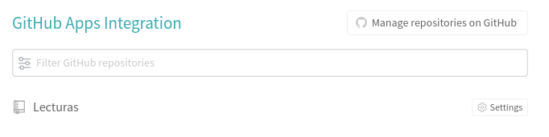
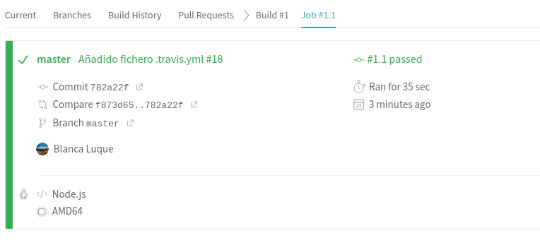
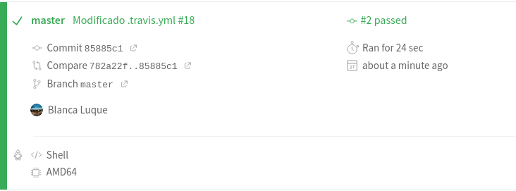

# Integración continua

## Configuración Travis

El primer paso es el registro en Travis, que va a ser mediante la cuenta de github, no hace falta registrarse de cero en la plataforma. Una vez registrada, hay que activar la integración con github:  
He seleccionado el repositorio del projecto (Lecturas), que es el que me interesa. Y ya lo tenemos


Resumiendo, el primer paso es activar el repositorio de Github y el segundo es añadir el fichero .travis.yml al repositorio. Este fichero contiene datos de la configuración. Yo para seguir con la continuidad del projecto, voy a configurar el fichero de manera que haga uso del Dockerfile creado en el hito anterior.
Al principio escribí el siguiente código en el fichero [.travis.yml](.travis.yml):

```
language:  
    - node

install:  
    - docker pull blancaazz/lecturas

script:  
    - docker run -t -v $TRAVIS_BUILD_DIR:/test blancaazz/lecturas
```

Que simplemente se basa en descargar la imagen que previamente se subió a DockerHub y ejecutarla de manera que haga los test también programados con anterioridad.
.

Habiendo escrito node lo que he hecho ha sido usar la última versión estable de Node.js. Esto es interesante porque es el lenguaje que uso en el projecto pero en realidad si leemos [esta página](https://docs.travis-ci.com/user/languages/javascript-with-nodejs/) podemos llevarnos la imagen general de que el default install sería npm install, el default script npm test. Y en realidad, yo no quiero hacer eso directamente. Sino hacerlo a través del contenedor y en el contenedor se va a instalar todo lo necesario para hacerlo, por lo tanto no aprovecharía todo lo que esta imagen ofrece (es decir, no tiene mucho sentido usar el lenguaje node con el contenedor Docker). Así que vamos a probar otra opción que es utilizar una imagen más genérica (que no sea de un lenguaje especifico):

```
language:
    - minimal

install:
    - docker pull blancaazz/lecturas

script:
    - docker run -t -v $TRAVIS_BUILD_DIR:/test blancaazz/lecturas
```

Cuando en el lenguaje ponemos [minimal](https://docs.travis-ci.com/user/languages/minimal-and-generic/) estamos teniendo en cuenta que la imagen minimal contiene, entre otras cosas, Docker. Está optimizada para ser más rápida y usar menos espacio. También se podría usar language:generic para tener más lenguajes y servicios disponibles. Pero en realidad, como todo lo que necesitamos lo descargamos en el contenedor (no necesitamos servicios adicionales), con la imagen minimal nos basta y así mejoramos la eficiencia.  
Vamos a probar a ejecutarla:  
  
Vemos que es ligeramente más rápida que la opción anterior. Esta tarda 24 segundos y la otra 35 segundos.   
*Entrando en la parte de Job Log en la sección Build system information, vemos que efectivamente cuando el lenguaje era node, se descarga más paquetes. De todos modos, creo que la diferencia de tiempo tampoco es muy grande.*  

- También he querido probar la opción generic para tener más datos con los que comparar. (He tenido un pequeño problema y es que ha aparecido como que Lecturas no estaba activado en travis así que al reactivarlo se han borrado las pruebas de antes). Al ejecutarlo sale que tarda 25 segundos, lo cual me sorprende porque pensaba que la diferencia iba a ser bastante mayor. 

- Otra cosa de las que me he dado cuenta es que no hace falta poner docker pull, pues el mismo comando docker run realiza esa función así que lo borro para que quede un código más compacto y, a la vez, tenga todo lo que necesito. 

- También nombrar el uso de la variable de entorno $TRAVIS_BUILD_DIR que es la dirección absoluta al directorio donde el repositorio ha sido copiado. Así nos aseguramos que no haya fallos de incompatibilidad al direccionar. 
Al ejecutar de nuevo el fichero definitivo sale que tarda un tiempo de [23 segundos](https://github.com/blancaazz/Lecturas/runs/1384940051). 

    ```
    language:
        - generic

    script:
        - docker run -t -v $TRAVIS_BUILD_DIR:/test blancaazz/lecturas
    ```

- También mencionar que estamos usando por defecto el sistema operativo linux y la imagen que se descarga de Ubuntu Xenial. Otras opciones hubieran sido dist:bionic (Ubuntu Bionic), dist:trusty (Ubuntu Trusty)


## Configuración Shippable

Para [Shippable](http://docs.shippable.com/) también podremos registrarnos directamente con la cuenta de GitHub.  
Ahora vamos a activar nuestro repositorio dentro de Shippable.   
Una vez activado el repositorio lo siguiente es crear un fichero shippable.yaml  
La dinámica de Shippable es que ejecuta código dentro de una build machine y en esa build machine contruye un contenedor. Luego se establece el entorno, se clona el repositorio y ya ejecuta el código que tú le pongas dentro de ese contenedor. 
Lo primero que he intentado ha sido probar a "sobreescribir" ese contenedor, es decir, que en vez de ejecutar el por defecto ejecute el mío pero me ha dado bastantes fallos y no sé hasta que punto tiene sentido. Ya que va a intentar clonar el repositorio dentro del contenedor y en realidad el contenedor es autosuficiente, no necesita que se le clone nada, ni se ejecute nada dentro, más allá de lo que tiene ya programado.  
Luego he intentado que ejecute el contenedor de Dockerfile una vez dentro del contenedor por defecto, pero me da una serie de fallos que no consigo resolver. Así que he decidido probar a hacer esto sin el contenedor de Dockerfile y directamente poner la instalación y ejecución de test con el gestor npm. Para esto en realidad hacen falta muy pocas líneas de código pues poniendo el lenguaje node_js, se ejecuta por defecto npm install y npm test. El tiempo que tarda en ejecutarse son 27 segundos.
Es una solución un poco sosa pues ni siquiera aparecen los test en la parte de test report de Shippable y solo aparecen en el [console](https://app.shippable.com/github/blancaazz/Lecturas/runs/39/1/console). Intentaré perfeccionarla para otro hito pero por ahora por lo menos es funcional y detecta correctamente si se pasan o no los tests.  
He encontrado Shippable como una plataforma un tanto más complicada de usar que Travis. También a nivel de documentación y de ejemplos me ha resultado más difícil, le he echado bastante tiempo y con pocos resultados. Mientras que con travis prácticamente de primeras conseguía hacer funcionar el código.

## Uso del gestor de tareas

Uso el gestor de tareas en travis a través del contenedor en el cual se usa make install, make test.
En cambio, en shippable como me daban bastantes fallos de otra manera no lo he hecho con mi Makefile sino usando npm. 

## Aprovechamiento del contenedor Docker

En travis he utilizado directamente el contenedor y no he tenido que hacer ninguna adaptación, tal cual estaba configurado funcionaba bien.  
A la hora de configurar Shippable si que lo he toqueteado intentando que funcionase, instalando paquetes adicionales pero al no conseguir que funcionara, lo he dejado tal como estaba previamente. 
