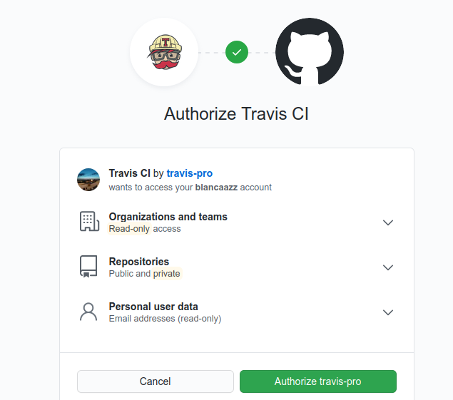
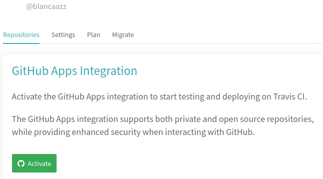
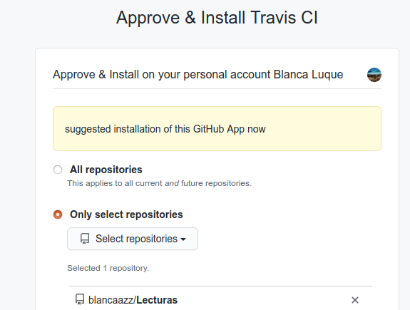

# Integración continua

El primer paso es el registro en Travis, que va a ser mediante la cuenta de github:

Una vez registrada, hay que activar la integración con github:

He seleccionado el repositorio del projecto, que es el que me interesa. Y ya lo tenemos

EL primer paso es activar el repositorio de Github y el segundo es añadir el fichero .travis.yml al repositorio. Este fichero contiene datos de la configuración. Yo para seguir con la continuidad del projecto, voy a configurar el fichero de manera que haga uso del Dockerfile creado en el hito anterior.
El fichero [.travis.yml](.travis.yml) contiene el siguiente código:

language:
    - node

install:
    - docker pull blancaazz/lecturas

script:
    - docker run -t -v $TRAVIS_BUILD_DIR:/test blancaazz/lecturas

Simplemente se basa en descargar la imagen que previamente se subió a DockerHub y ejecutarla de manera que haga los test también programados con anterioridad.
.

Voy a probar ahora a modificar el lenguaje. Habiendo escrito node lo que he hecho ha sido usar la última versión estable de Node.js. Esto es interesante porque es el lenguaje que uso en el projecto pero en realidad si leemos [esta página](https://docs.travis-ci.com/user/languages/javascript-with-nodejs/) podemos llevarnos la imagen general de que el default install sería npm install, el default script npm test. Y en realidad, yo no quiero hacer eso directamente. Sino hacerlo a través del contenedor y en el contenedor se va a instalar todo lo necesario para hacerlo, por lo tanto no aprovecharía todo lo que esta imagen ofrece. Así que vamos a probar otra opción que es utilizar una imagen más genérica (que no sea de un lenguaje especifico):

language:
    - minimal

install:
    - docker pull blancaazz/lecturas

script:
    - docker run -t -v $TRAVIS_BUILD_DIR:/test blancaazz/lecturas

Cuando en el lenguaje ponemos [minimal](https://docs.travis-ci.com/user/languages/minimal-and-generic/) estamos teniendo en cuenta que la imagen minimal contiene, entre otras cosas, Docker. Está optimizada para ser más rápida y usar menos espacio. También se podría usar language:generic para tener más lenguajes y servicios disponibles. Pero en realidad, como todo lo que necesitamos lo descargamos en el contenedor (no necesitamos servicios adicionales), con la imagen minimal nos basta y así mejoramos la eficiencia.  
Vamos a probar a ejecutarla:  
  
Vemos que es ligeramente más rápida que la opción anterior. Esta tarda 24 segundos y la otra 35 segundos. Entrando en la parte de Job Log en la sección Build system information, vemos que efectivamente cuando el lenguaje era node, se descarga más paquetes. De todos modos, creo que la diferencia de tiempo tampoco es muy grande. 

