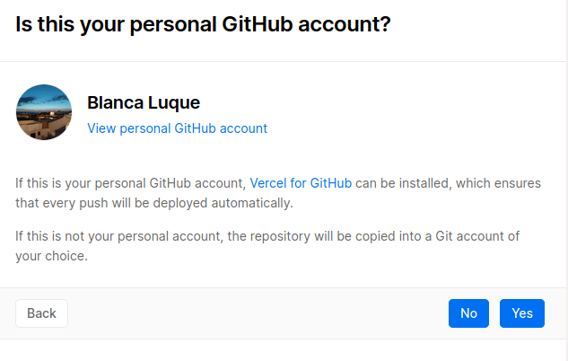

# Justificación Dockerfile 

## Justificación contenedor base

Para el Dockerfile me voy a ir directamente a la imagen oficial de [node](https://hub.docker.com/_/node). 

La versión por defecto es node:<version>, la cual es la que voy a probar primero y se supone que se recomienda cuando no se está segura de las necesidades. Entonces poniendo esto en mi Dockerfile voy a comprobar cuanto tarda y cuanto ocupa:
- #FROM node:14  
He elegido la versión 14 porque es de las últimas y se recomienda que no se ponga <latest> por si acaso surgiera una incompatibilidad que las últimas actualizaciones.  
Ejecutándolo, tarda 10 ms en pasar los tests y ocupa 972 mb

Voy a probar ahora con la variante node:<version>-alpine:  
- FROM node:14.14.0-alpine3.10  
En la página informa que es una versión mucho más pequeña, lo cual es muy positivo a la hora de descargarla en el máquina.  
Al ejecutarla de primeras me da un error de que no ha encontrado el comando make, (se ve que en la variante previa make sí venía incluido en la imagen) así que le añado esta línea para descargarlo: RUN apk update && apk add make && make install
al ejecutarlo tarda también 10 ms
pero de memoria ocupa 148MB, que es bastante menos que la otra.  

Ahora tocaría probar con node:<version>-slim:
- FROM node:14-slim   
Dice que no contiene los paquetes comunes y solo contiene lo necesario para ejecutar node. Al ejecutarlo efectivamente, tampoco incluye make pero, además, me da un fallo que no consigo solucionar.

De estas tres opciones, he decidido quedarme con la segunda pues es significativamente más pequeña y funciona bien. También está bastante recomendada por las buenas prácticas de Dockerfile.   
Con respecto a la versión he escogido la 14 para probar inicialmente porque es de las últimas y pienso que tiene que estar más actualizada, pero voy a probar otras para hacer una comparativa de tamaños y velocidades:  
Probando de primera con estas dos otras versiones:  
#FROM node:12.19.0-alpine3.10  
#FROM node:10.23.0-alpine3.10  
Me dan un fallo tal que Error: Cannot find module 'worker_threads'. Y tiene sentido pues mi versión de node es la v14.13.0, entonces creo que será algún tipo de incompatibilidad por trarse de una versión tan baja. He encontrado en internet una posible manera de solucionar ese error pero creo que es más interesante y conveniente usar la versión 14.  

## Buenas prácticas

- En mi Dockerfile trato que no se incluyan archivos innecesarios para construir la imagen, que causaría mayor tamaño y tiempo de construcción.   

- A nivel de instrucciones, uso una imagen oficial para el FROM, además desde [las buenas prácticas](https://docs.docker.com/develop/develop-images/dockerfile_best-practices/) se recomienda usar alpine, que es lo que estoy usando.   

- El Run que uso no es demasiado complejo y se puede leer en la misma línea sin problemas.  
 Además el hecho de hacer las distintas instrucciones en la misma línea, es bastante recomendable para que si modificamos algo, ejecute todas las instrucciones. Nos aseguramos que Dockerfile instala la última versión del paquete que sea (RUN apk update && apk add make).  

- Uso CMD["make", "test"] para ejecutar el software contenido en la imagen, en este caso el task runner junto con la instrucción test.  

- Entre ADD y COPY, estoy usando COPY porque está más recomendado al ser más transparente. Para lo que 
lo estoy usando que es una copia sencilla de ficheros locales, COPY hace justamente eso y por lo cual, creo que es mejor.  

- Recomienda hacer las instrucciones COPY individualmente, que es lo que estoy haciendo, primero copio el make y luego el package.json. Creo que lo mejor sería poner antes el que menos tendencia tenga de cambiar, y en este caso creo que puede ser el make.   

- Algo bastante importante también es que el servicio se ejecute sin privilegios, para ello se usa la instrucción USER para cambiar a un usuario no root. La imagen por defecto de [node:14-alpine](https://github.com/nodejs/docker-node/blob/7b11db1cab459beb96448e18ec421ec952fa0491/14/alpine3.10/Dockerfile) trae un usuario alternativo al root que se llama node y es el que yo estoy usando. 

- Para terminar, también uso WORKDIR /test, por hace más claro todo el código y determinar así el directorio donde se está trabajando. 

## Justificación de la configuración DockerHub

Me creé una cuenta de DockerHub con el correo de la ugr y el id blancaazz. De lo primero que hice fue ligarla a la cuenta de github.  
De ahí me logueé desde la terminal con docker login. Y ya pude subir el repositorio a DockerHub:

  

Y desde ahí, en el apartado Build, lo asocié al repositorio de github Lecturas para que con cada push se actualice el contenido del Dockerfile, documentación, etc...

De hecho, aquí se ven las actualizaciones que se han producido de esta manera:  
 

## Registro alternativo: Vercel

Para configurar otro sitio desde donde desplegar la aplicación he escogido Vercel pues estaba redirigido desde la pagina de ejercicios de autoevaluación, es gratuito y me parecía una buena opción ya que también proporciona una integración con github bastante fácil e intuitiva.   
Para ello, primero me he creado una cuenta y he ido siguiendo estos pasos:

  
He escogido subir solamente el repositorio correspondiente al projecto. Luego he tenido que configurar un par más de opciones y ya se sube: 
  
Voy a probar ahora a actualizar el repositorio y pushearlo para ver si efectivamente se actualiza automáticamente.  
  
Vemos que sí, que se ha actualizado también en vercel cuando he subido la nueva versión a github.      
  
Ahora tenemos el proyecto visible desde [aquí](https://lecturas.vercel.app/)