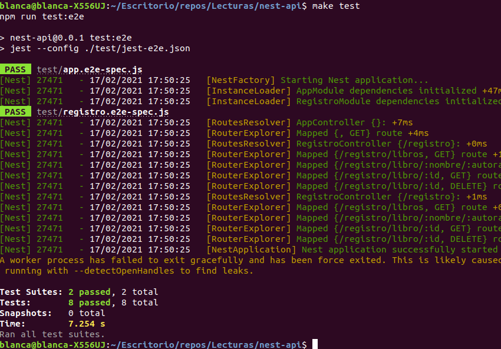

# Justificación del framework elegido

En la comparación entre los diferentes frameworks disponibles para Nodejs, he tenido en cuenta las siguientes características de mi proyecto:   
- Se trata de un proyecto relativamente sencillo, no necesito una herramienta enfocada en proyectos con mucho código.
- La dinámica del proyecto va a consistir sobre todo en guardar libros (post), modificarlos (put) y acceder a ellos (get). No tiene excesiva complejidad.
- Es importante el desacoplamiento entre lógica de negocio, API, acceso a los datos. Pero no tengo demasiado código como para que se haga complicada su organización.  
   
    
Por eso, he barajado framework como Express por ser el más popular, de uso sencillo; Nest.js por sus muchas funcionalidades y la organización que hace del código. He estado mirando otros también como Sails.js, pero lo he descartado porque está enfocado en aplicaciones que necesitan más potencia y son más grandes. También he estado mirando las características de otros como Koa o Hapi.     
Y teniendo en cuenta que mi aplicación no necesita tanto, cualquiera de las opciones anteriores estaría bien, al final he optado por usar, inicialmente, Nest.js porque también ofrece facilidad de uso para el tema de middleware, logs, ... , para aprender a usarlo y por la organización de ficheros que tiene.    
Sin embargo, cuando me he puesto a leer la documentación e implementar la api en Nest, me he dado cuenta que no podía reutilizar tanto código que tenía hecho previo. Nests tiene un esqueleto marcado en el que diferencia claramente entre controllers, providers y módulos, lo cual está muy bien para favorecer el desacoplamiento. Pero en mi caso, como quería aprovechar más el código que tenía previo y probar a hacer mi propia estructura. Lo que he hecho ha sido implementar primero el api en Nest para también ver así las diferencias de tiempo. Y luego, he hecho el api con Express, para hacer una comparativa entre ambos y así también me he dado cuenta que el tiempo que tarda en hacer los tests en Nest es bastante (también puede deberse a un factor que comentaré luego)

- Tiempo con Express:

Aquí hace los test unitarios y de integración.

- Tiempo con Nest

Aquí no está haciendo los unitarios, y cabe mencionar que en la (documentación)[https://docs.nestjs.com/fundamentals/testing] lo hace a través de una clase llamada Test, y yo lo hago levantando la aplicación (creo que por eso puede ser que tarde más también)

# Diseño general del API

Voy a diseñar un API basado en las historias de usuaria 1, 2, 3 y 4.  
Por tanto, las rutas son las siguientes:    

- /registro/libro/:nombre/:autora/:comentario/:puntuacion (HU1), con el método POST, se calcula el id internamente en el controlador, se crea el libro y se registra en el registro de libros

- /registro/libro/:id (HU2), con el método GET, se devuelve información sobre el libro con el correspondiente id.

- /registro/libros, (HU3) con el método GET, se devuelve toda la lista de libros del registro

- /registro/libro/:id (HU4) con el método DELETE, se elimina del registro el libro con el correspondiente id