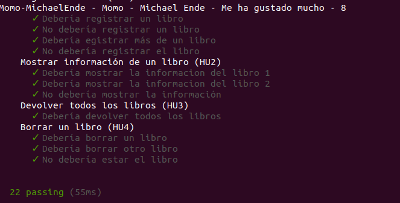
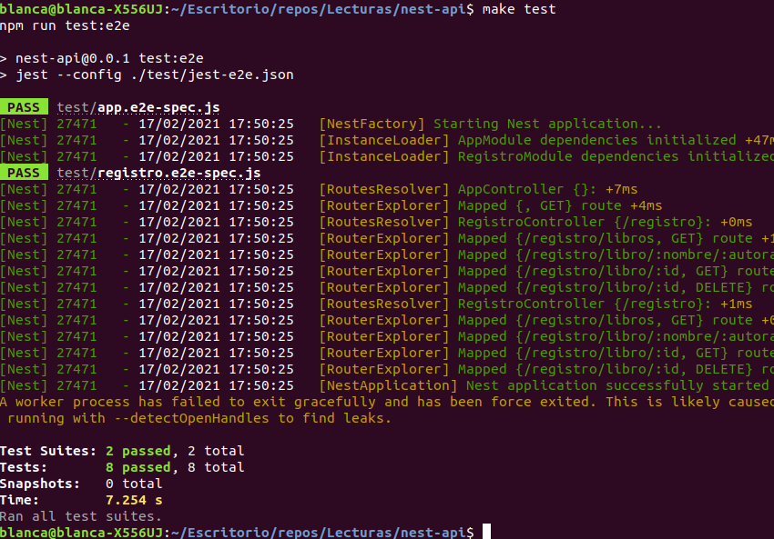

# Justificación del framework elegido

En la comparación entre los diferentes frameworks disponibles para Nodejs, he tenido en cuenta las siguientes características de mi proyecto:   
- Se trata de un proyecto relativamente sencillo, no necesito una herramienta enfocada en proyectos con mucho código.
- La dinámica del proyecto va a consistir sobre todo en guardar libros (post), modificarlos (put) y acceder a ellos (get). No tiene excesiva complejidad.
- Es importante el desacoplamiento entre lógica de negocio, API, acceso a los datos. Pero no tengo demasiado código como para que se haga complicada su organización.  
   
    
Por eso, he barajado framework como Express por ser el más popular, de uso sencillo; Nest.js por sus muchas funcionalidades y la organización que hace del código. He estado mirando otros también como Sails.js, pero lo he descartado porque está enfocado en aplicaciones que necesitan más potencia y son más grandes. También he estado mirando las características de otros como Koa o Hapi.     
Y teniendo en cuenta que mi aplicación no necesita tanto, cualquiera de las opciones anteriores estaría bien, al final he optado por usar, inicialmente, Nest.js porque también ofrece facilidad de uso para el tema de middleware, logs, ... , para aprender a usarlo y por la organización de ficheros que tiene.    
Sin embargo, cuando me he puesto a leer la documentación e implementar la api en Nest, me he dado cuenta que no podía reutilizar tanto código que tenía hecho previo. Nests tiene un esqueleto marcado en el que diferencia claramente entre controllers, providers y módulos, lo cual está muy bien para favorecer el desacoplamiento. Pero en mi caso, como quería aprovechar más el código que tenía previo y probar a hacer mi propia estructura. Lo que he hecho ha sido implementar primero el api en Nest para también ver así las diferencias de tiempo. Y luego, he hecho el api con Express, para hacer una comparativa entre ambos y así también me he dado cuenta que el tiempo que tarda en hacer los tests en Nest es bastante (también puede deberse a un factor que comentaré luego)

- Tiempo con Express:



Aquí hace los test unitarios y de integración.

- Tiempo con Nest



Aquí no está haciendo los unitarios, y cabe mencionar que en la (documentación)[https://docs.nestjs.com/fundamentals/testing] lo hace a través de una clase llamada Test, y yo lo hago levantando la aplicación (creo que por eso puede ser que tarde más también)

# Diseño general del API

Voy a diseñar un API basado en las historias de usuaria 1, 2, 3 y 4.  
Por tanto, las rutas son las siguientes:    

- /registro/libro/:nombre/:autora/:comentario/:puntuacion (HU1), con el método POST, se calcula el id internamente en el controlador, se crea el libro y se registra en el registro de libros

- /registro/libro/:id (HU2), con el método GET, se devuelve información sobre el libro con el correspondiente id.

- /registro/libros, (HU3) con el método GET, se devuelve toda la lista de libros del registro

- /registro/libro/:id (HU4) con el método DELETE, se elimina del registro el libro con el correspondiente id


# Nest.js
 
Primero lo que he hecho ha sido un git clone de la opción que pone los ficheros con js y he creado un projecto llamado lect-nest-api, pero da un error de incompatibilidad, así que lo he creado con el comando: nest n -l js "nest-api"   

Nest tiene dos maneras de gestionar las respuestas, yo he usado la Standard, la cual convierte automáticamente a JSON la respuesta cuando es un objeto o un array. También importante es que el código de estado por defecto es 200 (se cambia añadiendo @HttpCode(...) decorador), menos cuando es un POST, que es 201.   

He implementado el [controlador](../nest-api/src/registro/registro.controller.js), [servicio](../nest-api/src/registro/registro.service.js)y [módulo](../nest-api/src/registro/registro.module.js) del registro. Dentro de la carpeta también he añadido la clase libro (el id va a tener el valor del "nombre del libro"-"nombre del autora".)

    
Las rutas diseñadas han sido: 

- /registro/libros: correspondiente a la historia de usuaria 3, que devuelve una lista con todos los libros registrados.

```
    @Get("libros")
    devolverTodo(){
        return this.registroService.listaLibros();
    }

```
Siendo la función listaLibros()

```
    listaLibros(){
        return this.libros
    }    
```

poner ejemplossss

- /registro/libro/:nombre/:autora/:comentario/:puntuacion

```
    @Post("libro/:nombre/:autora/:comentario/:puntuacion")
    @Bind(Param())
    registrarLibro(params){
        //para crear un id único vamos a usar el nombre y la autora:
        var id = params.nombre + "-" + params.autora;
        id = id.replace(/ /g, "");
        var libro = new Libro(id, params.nombre, params.autora, params.comentario, params.puntuacion);

        this.registroService.registrarLibro(libro);
        return libro
    }
```
siendo la función registrarLibro

```
    registrarLibro(libro){
        if(libro instanceof Libro){
            var num = this.libros.indexOf(libro);
                if(num == -1){
                this.libros.push(libro);
            }           
        }
    }
```

ejemplo

- /registro/libro/:id

```
    @Get("libro/:id")
    @Bind(Param())
    devolverLibro(params){
        return this.registroService.getLibro(params.id)
    }
```
siendo la función getLibro

```
    getLibro(id){
        var libro = this.libros.find(libroA => libroA.id === id)
        return libro;
    }

```
ejemplo

- /registro/libro/:id

```
    @Delete("libro/:id")
    @Bind(Param())
    borrarLibro(params){
        this.registroService.borrarLibro(params.id)
    }
```

siendo la función borrar Libro

```
    borrarLibro(id){
        var libro = this.getLibro(id)
        if(libro instanceof Libro){
            var num = this.libros.indexOf(libro);
            if(num != -1 && this.libros.length > 0){
                this.libros.splice(num, 1);
            }
        }
    }
}
```

Como se ve, se utiliza una clase controladora que llama a una clase servicio para desacoplar las diferentes capas. En la capa controladora se recibe y devuelven las peticiones, pero ésta, internamente, llama a la clase servicio que gestiona el tratamiento de los datos. (En este caso, utilizo variables para este hito pero la idea sería diseñar el acceso a una base de datos).    
También es interesante el uso del decorador @Injectable(), ya que permite el uso de la inyección de dependencias. El hecho de que tenga módulos, permite también organizar las dependencias necesarias para cada uno.    
Podía haber sido interesante usar otras cosas como validaciones de clase o usar TypeScript en vez de JavaScript.


# Test con nestjs

Primero instalamos npm i --save-dev @nestjs/testing.
Este paquete provee una clase llamada Test que facilita el proceso de testeo. Y también voy a usar la biblioteca Supertest.   
Nest directamente crea un fichero de test por cada controlador o servicio añadido. Para que funcione el controlador hay que tener en cuenta la inyección de dependencias y añadirle "providers: [RegistroService]" al crear el test. (los test unitarios están usando jest)

- npm run test -> para los unit test
- npm run test:e2e -> para end-to-end testing

Para los e2e en la aplicación principal he tenido que cambir import request from supertest (sino da error).         
He implementado las funciones para el test en el siguiente fichero: [registro.e2e.spec](../nest-api/test/registro.e2e-spec.js), ahí se comprueba todas las rutas previamente diseñadas.


# Middleware con nestjs

He creado un fichero [logger.middleware.js](../nest-api/src/logger.middleware.js) donde programar la función para la parte de log.    
En Nest se puede crear una clase o una función pero la clase me ha dado problemas, así que he optado por hacer una función y hacerla global, es decir, que se haga para todo los requests (se añade a la aplicación en el main mediante app.use(logger))    
También hay una clase llamaa Logger en nest con lo que se pueden especificar mejor y más las opciones, pero he optado por hacer esta manera más sencilla.

```
export function logger(req, res, next){
  var metodo = req.method;
  var codigo = res.statusCode;
  var url = req.originalUrl;
  var dat_tiempo = new Date();
  let mes = dat_tiempo.getMonth() + 1;
  var año = dat_tiempo.getFullYear();
  var dia = dat_tiempo.getDate();
  var horas = dat_tiempo.getHours();
  var minutos = dat_tiempo.getMinutes();

  console.log("Peticion realizada a las " + dia + "-" + mes + "-" + año + " " + horas + ":" + minutos);
  console.log("Url: " + url + " - Método: " + metodo + " -  Código de estado: " + codigo + "")
  next();
};
```
    
También quería aprovechar que estaba usando Nest para generar la documentación ya que tiene un [módulo](https://github.com/nestjs/swagger) que facilita documentar las api. Pero me he dado cuenta que, por lo visto, solo permite esa funcionalidad con TypeScript y no con JavaScript.   

Habiendo hecho todo esto con Nest me he dado cuenta de que es una herramienta potente, que igual se aprovecharía más usando TypeScrit y funcionalidades más avanzadas. Para lo que yo necesito en mi proyecto me parece demasiado, así que voy a documentar ahora la solución con Express.

# Express

Primero lo instalamos 
```
npm install express --save
```
Guardándolo en las dependencias.
   
Comentar que hay parte que voy a poder reutilizar de la implmentación hecha previamente con Nest. 


Voy a implementar las mismas historias de usuario que con nest.js, el diseño de las rutas, por lo tanto, va a ser el mismo:
- registro/libro/:id con los métodos get y delete
- registro/libro/:nombre/:autora/:comentario/:puntuacion con el método post
- registro/libros con el método get que devuelve todos los libros

Lo primero que he hecho para desacoplar el acceso a datos con la lógica de negocio es crear la clase [Dator](../src/dator.js). Esta clase será llamada desde [Registro de Libro](../src/Registro_libros.js) para todas las funciones relacionadas con el acceso a datos. Además Dator estará en el constructor del registro. De momento, guardaré los datos en una variable que se va a ir creando y destruyendo cada vez que se lanza el servidor.   
También he separado las rutas en un fichero [rutas.js](../src/rutas.js) y la puesta en marcha del servidor en el fichero [index.js](../src/index.js).   
He hecho algunas modificaciones en las clases Libro y Registro de Libros y en sus respectivos test unitarios para, entre otras cosas, adaptarlo a la inyección de dependencias, añadir id al libro.   

La implementación de las rutas es básicamente:

```

app.get("/", function(req, res){
    res.status(200).send("Conexión establecida")
})

app.get("/registro/libros", function(req, res){
    var libros = registro.listaLibros();
    res.status(200).send(libros)
})

app.post("/registro/libro/:nombre/:autora/:comentario/:puntuacion", function(req, res){
    var id = req.params.nombre + "-" + req.params.autora;
    id = id.replace(/ /g, "");
    var libro = new Libro(id, req.params.nombre, req.params.autora, req.params.comentario, req.params.puntuacion);
    registro.registrarLibro(libro);
    res.status(200).send(libro)
})

app.route("/registro/libro/:id")
    .get(function(req, res){
        var libro = registro.obtenerLibro(req.params.id);
        if(libro != undefined){
            res.status(200).send(libro)
        }
        else{
            res.status(404).send({"error": "No encontrado el libro"})
        }
    })
    .delete(function(req, res){
        registro.borrarLibroId(req.params.id)
        res.status(200).send({"mensaje": "ok, borrado"})
    });
```

# Test con Express 

Para los test he reutilizado bastante el código que hice para Nest, pues éste utiliza por debajo express y en ambos estoy usando la biblioteca SuperTest:

```
const request = require("supertest");
const app = require("../src/rutas.js")


describe("Llamadas al registro", function(){

    it("Deberia registrar un libro (Momo)", function(done){
        request(app)
            .post("/registro/libro/Momo/Michael Ende/Ha estado genial/8")
            .expect("Content-Type", /json/)
            .expect(200, {
                id: "Momo-MichaelEnde",
                nombre: "Momo",
                autora: "Michael Ende",
                comentario: "Ha estado genial",
                puntuacion: "8"
            }, done);
    })

    it("Deberia registrar un libro (La historia interminable)", function(done){
        request(app)
            .post("/registro/libro/La historia interminable/Michael Ende/Me ha gustado/7")
            .expect("Content-Type", /json/)
            .expect(200, {
                id: "Lahistoriainterminable-MichaelEnde",
                nombre: "La historia interminable",
                autora: "Michael Ende",
                comentario: "Me ha gustado",
                puntuacion: "7"
            }, done);
    })


    //Correspondientes a la ruta /registro/libros
    //en este caso como solo está registrado Momo, voy a poner que tendría que devolver ese
    it("Debería devolver los libros", function(done){
        request(app)
            .get("/registro/libros")
            .expect("Content-Type", /json/)
            .expect(200, [{
                id: "Momo-MichaelEnde",
                nombre: "Momo",
                autora: "Michael Ende",
                comentario: "Ha estado genial",
                puntuacion: "8"
            }, {
                id: "Lahistoriainterminable-MichaelEnde",
                nombre: "La historia interminable",
                autora: "Michael Ende",
                comentario: "Me ha gustado",
                puntuacion: "7"
            }], done);
    });

    it("No debería devolver los libros (es una ruta inexistente)", function(done){
        request(app)
            .get("/registro/libross")
            .expect(404, done);
    });

    //Correspondientes a la ruta /registro/libro/:id
    it("Deberia devolver información de un libro en función de su id", function(done){
        request(app)
            .get("/registro/libro/Momo-MichaelEnde")
            .expect("Content-Type", /json/)
            .expect(200, {
                id: "Momo-MichaelEnde",
                nombre: "Momo",
                autora: "Michael Ende",
                comentario: "Ha estado genial",
                puntuacion: "8"
            }, done);
    })

    //Correspondientes a la ruta /registro/libro/:id
    it("Deberia borrar el libro de Momo", function(done){
        request(app)
            .delete("/registro/libro/Momo-MichaelEnde")
            .expect(200, done);
    })

    //ahora para comprobar que se ha borrado voy a hacer una nueva llamada
    //a la función que devolvía todos los libros:
    it("Debería devolver los libros", function(done){
        request(app)
            .get("/registro/libros")
            .expect("Content-Type", /json/)
            .expect(200, [{
                id: "Lahistoriainterminable-MichaelEnde",
                nombre: "La historia interminable",
                autora: "Michael Ende",
                comentario: "Me ha gustado",
                puntuacion: "7"
            }], done);
    });    

});
```
Los test se encuentran en este [fichero](../test/Api.js)


# Middleware con Express

Básicamente consiste en añadirle la función 

```
var logger = function(req, res, next){
    var metodo = req.method;
    var codigo = res.statusCode;
    var url = req.originalUrl;
    var dat_tiempo = new Date();
    let mes = dat_tiempo.getMonth() + 1;
    var año = dat_tiempo.getFullYear();
    var dia = dat_tiempo.getDate();
    var horas = dat_tiempo.getHours();
    var minutos = dat_tiempo.getMinutes();
  
    console.log("Peticion realizada a las " + dia + "-" + mes + "-" + año + " " + horas + ":" + minutos);
    console.log("Url: " + url + " - Método: " + metodo + " -  Código de estado: " + codigo + "")
    next();    
}
```
Y luego app.use(logger) para cargar la función.