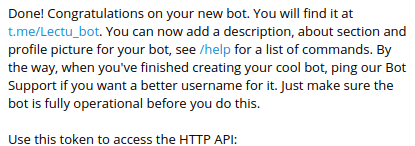
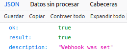

# Serverless

## Despliegue con Vercel

Ya tengo conectado Vercel a mi cuenta de github. Para las desplegar funciones serverless sin configuración adicional se crea la carpeta api.  
Cada petición da acceso a un objeto request y response. Este último será nuestra respuesta, así que tendremos que asignarle el contenido y estado que queramos.  
Primero voy a probar a implementar la historia de usuario 3, donde hay que resolver que se devuelvan todos los libros que tengamos en el registro. Antes de eso, tengo que decidir de dónde voy a tomar esos datos.    
Para no complicarme mucho y dado que no hace falta que conectemos una base de datos, para un primer acercamiento he creado un fichero que se llama datos.js donde creo un registro con un par de libros. Si luego quisiera añadirle una base de datos he encontrado información en este [enlace](https://vercel.com/docs/solutions/databases).    
- He creado ya una primera función muy básica que te devuelve toda la información:

```
module.exports = (req, res) => {
    registro = datos.crearRegistro();
    res.send(registro.as_string())
}
```   
- Para ver el resultado de la petición: https://lecturas-h8qv2p50o.vercel.app/api/lista-libros

Sin embargo, la respuesta me la devuelve como una cadena de texto y el hito nos pide que la devuelva en JSON así que mi primera idea fue crear un par de funciones auxiliares en la clase Libro y en la clase Registro para devolver un JSON. Pero a base de prueba y error y estar investigándolo, resulta que cuando hacemos res.send(body), body puede ser un string, un objeto o un Buffer. Cuando hacemos que sea un objeto, al acceder a la página se devuelve como JSON. Otra opción sería hacer res.json(obj). Así que no hace falta que llame a las funciones auxiliares, sino que devolviendo directamente el objeto en la función, aparece como JSON, tal que: res.send(registro);   
De esta manera estaría creada ya la primera función correspondiente a la historia de usuaria 3, la cual es bastante sencilla. Así que voy a proceder a realizar otra que incluya el uso de parámentros.    
Por ejemplo, en mi historia de usuaria quiero resolver el mostrar por pantalla la información correspondiente a un libro. Para ello, debería pasar como parámetro el nombre del libro. 

- El código de la función es el siguiente:

```
module.exports = (req, res) => {
    registro = datos.crearRegistro();
    var nombre = req.query.nombre;
    var libro = registro.getLibro(nombre);
    if (libro == undefined){
        res.send({error: "No se ha introducido correctamente"})
    }
    res.send(libro);    
}


```

Primero creamos el registro como antes y luego capturamos el nombre del libro de la url (req.query.nombre) para llamar a la función del registro de libros que nos devuelve el nombre correspondiente (registro.getLibro(nombre)).    
Si el libro que se llama no existe o no se usa correctamente el parámetro nombre, lo he implementado de manera que devuelva un JSON con un campo de error.    
- Para ver el resultado de la petición: https://lecturas-h8qv2p50o.vercel.app/api/libro?nombre=Momo     

- Los archivos para el despliegue de estas funciones están en la [carpeta api](../api)

## Despliegue con Netlify

Ya me he registrado en Netlify y autorizado el repositorio correspondiente al proyecto. Otra de las cosas que he hecho es instalar Netlify CLI con el comando npm install netlify-cli -g (para que sea global) porque, entre otras cosas, quiero usar Netlify dev para probar primero localmente las funciones.    
Para configurar Netlify podemos hacerlo desde la página web o en el archivo netlify.toml. Voy a configurarlo de la segunda manera. Lo primero que quiero hacer es configurar el directorio desde el cuál ejecutar las funciones serverless, para eso ponermos esta línea:

```
[build]
    functions = "./my-functions"

```

En realidad, no necesito ninguna configuración adicional para que funcione el código que quiero probar en este hito.
Lo que voy a hacer es implementar también la función de buscar libro para probar el uso de parámetros en Netlify. Estuve un buen rato pensando en cómo hacer las otras dos historias de usuario pero como son de insertar y borrar datos me parece que no tiene mucho sentido hacerlas como prototipado pues estaría más tiempo mirando las maneras de guardar y borrar datos, cuando es algo que más adelante abarcaré probablemente desde el uso de una base de datos.   

- El código de la función de buscar datos es en siguiente

```

exports.handler = async function(event, context){
    var nombre = event.queryStringParameters.nombre;
    registro = datos.crearRegistro();
    var libro = registro.getLibro(nombre);
    var contenido;
    var estado;
    if(libro != undefined){
        contenido = JSON.stringify(libro);
        estado = 404;
    }
    else{
        contenido = JSON.stringify({error: "Fallo al buscar libro"});
        estado = 200;
    }
    return {       
        statusCode: estado, 
        body: contenido
    }; 
    
}

```
Hago lo mismo que con Vercel, creo el registro con un par de libros. Obtengo el nombre pasado en la url y llamo a la función de la clase registro de libros. Lo único que cambia es las formas, ya que en Netlify devolvemos el objeto, mientras que Vercel nos pasaba el objeto para escribir en él. También mencionar que en Netlify hay que poner código de estado porque sino sale este mensaje. "Your function response must have a numerical statusCode. You gave: $ undefined".

- Los archivos para el despliegue de esta función están en la carpeta [my-functions](../my-functions)   
- Y para hacer una petición: https://lecturas.netlify.app/.netlify/functions/libro?nombre=Momo


## Despliegue en bot telegram en Vercel

He creado un fichero dentro de API llamado bot-telegram para gestionar desde ahí las peticiones del bot. 
He creado con el BotFather un bot:

Para establecer el webhook hay que hacer: 
```
https://api.telegram.org/bot{my_bot_token}/setWebhook?url={url_to_send_updates_to}
```

Lo cual nos da la siguiente respuesta:


He creado una variable de tipo secreto que contiene el token del bot de telegram. (TOKEN_TELEGRAM)

Para probar el bot de manera local estoy haciendo uso de ngrok. Simplemente ngrok http 3000, y ya tenemos la url para establecer el webhook mientras hago pruebas. 
Me he ayudado de la librería Axios para realizar peticiones http. 
He estado investigando con las apis que había para facilitar la construcción del bot y los framework, pero quería probar a hacerlo sin framework. Y al final, investigando la opción de usar axios es la que he encontrado más asequible, son pocas líneas de código y eficiente. 


## Despliegue en Netlify 

Voy a abordar el despliegue de una función correspondiente a una historia de usuario nueva. Consiste en devolver una lista de libros recomendados para leer. Me parece una funcionalidad que se puede integrar de una manera útil en el proyecto.  
Sigue la temática de libros y lecturas, y lo que hace es ofrecerte un repertorio de libros 
Además como será una base de datos la cual tampoco variará mucho
