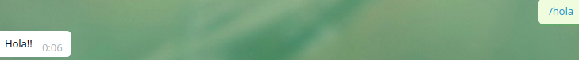
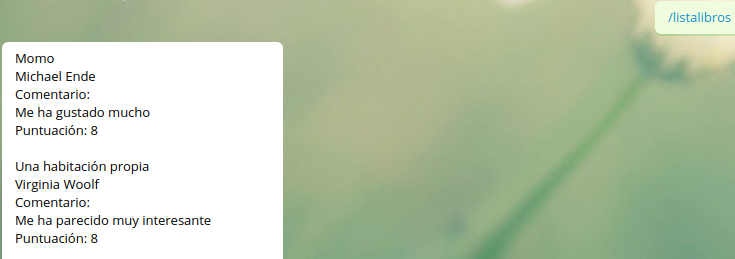
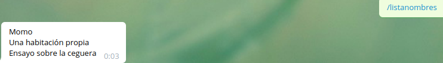
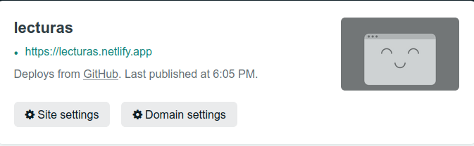
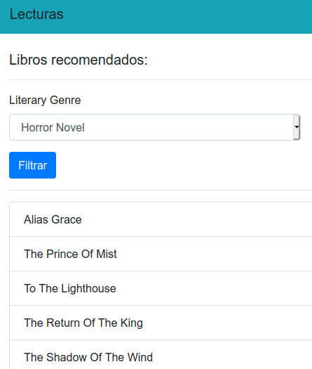

# Serverless

## Despliegue con Vercel

Primero se conecta la cuenta de github a la de Vercel, para eso podemos iniciar sesión en Vercel con la cuenta de Github y luego autorizar el repositorio de Lecturas.


Ahora cada push en github también se actualiza en Vercel.  
Una vez conectado para las desplegar funciones serverless se crea la carpeta api y ahí se programan las funciones, no hace falta otro tipo de configuración adicional.


## Integración dentro del projecto con Vercel

He implementado dos funciones, una corresponde a la historia de usuaria 3 (devuelve todos los libros que hemos registrado) y la otra a la historia de usuaria 2 (devuelve información sobre el libro que introduzcas).

- Para la primera función el código es muy sencillo: 

```
module.exports = (req, res) => {
    registro = datos.crearRegistro();
    console.log(registro.mostrarInformacion())
    res.send(registro)
}

```    

Cada petición da acceso a un objeto request y response. Este último será nuestra respuesta, así que tendremos que asignarle el contenido y estado que queramos.  
Cuando hacemos res.send(body), body puede ser un string, un objeto o un Buffer. Cuando hacemos que sea un objeto, al acceder a la página se devuelve como JSON. Otra opción sería hacer res.json(obj).   
Lo que hago es crear un registro y mandarlo directamente. 

- Para ver el resultado de la petición: https://lecturas.vercel.app/api/lista-libros

- Para la segunda función: 

```
module.exports = (req, res) => {
    registro = datos.crearRegistro();
    var nombre = req.query.nombre;
    var libro = registro.getLibro(nombre);
    if (libro == undefined){
        res.status(404).send({error: "No se ha introducido correctamente"})
    }
    res.status(200).send(libro);    
}

```

Primero creamos el registro como antes y luego capturamos el nombre del libro de la url (req.query.nombre) para llamar a la función del registro de libros que nos devuelve el información sobre el libro correspondiente (registro.getLibro(nombre)).    
Si el libro que se llama no existe o no se usa correctamente el parámetro nombre, lo he implementado de manera que devuelva un JSON con un campo de error y el estado 404.

- Para ver el resultado de la petición: https://lecturas.vercel.app/api/libro?nombre=Momo 

   
Para los datos he creado un fichero que se llama datos.js donde hay una función en la cual se crea un registro con un par de libros.  

- Los archivos para el despliegue de estas funciones están en la [carpeta api](../api)   

Me parece que estas funcionalidades son interesantes para luego, en vez de crear los datos de esta manera (que es más bien para probar), se conectase con la base de datos que almacena los libros registrados. De esta manera, se podrían obtener, insertar, modificar datos con las ventajas que proporciona la computación serverless. Y también, por ejemplo, conectar todo esto con un bot de telegram.


## Despliegue de un bot telegram en Vercel

- He creado un fichero dentro de API llamado bot-telegram para gestionar desde ahí las peticiones del bot. 
- He creado con el BotFather un bot:

   

Para establecer el webhook hay que hacer:

```
https://api.telegram.org/bot{my_bot_token}/setWebhook?url={url_to_send_updates_to}

```

Lo cual nos da la siguiente respuesta:   


He creado una variable de tipo secreto que contiene el token del bot de telegram. (TOKEN_TELEGRAM)

Para probar el bot de manera local estoy haciendo uso de ngrok. Simplemente ngrok http 3000, y ya tenemos la url para establecer el webhook mientras hago pruebas. 
Me he ayudado de la librería Axios para realizar peticiones http. 
He estado investigando con las apis que había para facilitar la construcción del bot y los framework, pero quería probar a hacerlo sin framework. Y al final, investigando la opción de usar axios es la que he encontrado más asequible, son pocas líneas de código y eficiente.    

El código está en el fichero [bot-telegram](../api/bot-telegram.js).   
He hecho funciones para el comando /hola (de prueba, devuelve Hola!!), /listalibros (devuelve todos los libros registrados), /listanombres (devuelve una lista con el nombre de todos los libros), /libro "nombre_libro" (devuelve información sobre un libro)






## Despliegue con Netlify

Ya me he registrado en Netlify y autorizado el repositorio correspondiente al proyecto. 



Está conectado con github, de manera que cada push a la cuenta de github actualiza automáticamente la de Netlify.

Otra de las cosas que he hecho es instalar Netlify CLI con el comando npm install netlify-cli -g (para que sea global) porque, entre otras cosas, quiero usar Netlify dev para probar primero localmente las funciones.   

Para configurar Netlify podemos hacerlo desde la página web o en el archivo netlify.toml. Voy a configurarlo de la segunda manera:

```
[build]
    functions = "./my-functions"
    publish = "my-functions/"

```

De esta manera busca las funciones programadas en la carpeta my-functions y también la página html que he creado. 


## Integración dentro del proyecto con Netlify

He creado dos historias de usuario.  
- HU7 -> Obtener una lista de libros recomendados. 
- HU8 -> Filtrar los libros recomendados por género.

Estas dos historias de usuario vienen motivadas por la idea de ofrecer la funcionalidad adicional de mostrar una lista de libros en la cual inspirarse a la hora de elegir una nueva lectura.   
He implementado una función serverless dentro del fichero [lista-recomendaciones](../my-functions/lista-recomendados.js). Esta función acepta diferentes parámetros.
- Si no hay ningún parámetro te devuelve una lista con los nombres de todos los libros.   
Ej: https://lecturas.netlify.app/.netlify/functions/lista-recomendados
- Si está el parámetro nombre y coincide con el nombre de un libro, te devuelve información sobre ese libro.  
Ej: https://lecturas.netlify.app/.netlify/functions/lista-recomendados?nombre=Momo
- Si está el parámetro género y coincide con uno de los posibles géneros literarios, te devuelve una lista de nombres de libros de ese género.  
Ej: https://lecturas.netlify.app/.netlify/functions/lista-recomendados?genero=Essay

Para separar la lógica de negocio todas las funciones que interactúan con los datos están en un fichero a parte: [funciones_datos](../my-functions/funciones_datos.js).  

Los datos están en un fichero json en la misma carpeta.    


## Integración con un front end con Netlify

He creado una página web para mostrar los datos que se obtienen a través de la función serverless desplegada en Netlify. Para ello, he creado un fichero [index.html](../my-functions/index.html) y otro [index.js](../my-functions/index.js) que gestiona el documento html de forma dinámica.  
Es una página muy sencilla que hace llamadas a la función serverless y obtiene la lista de géneros para introducirlas en una lista donde se puede elegir una opción para filtrar los libros.   
Para ir a la página: https://lecturas.netlify.app/  



Como herramientas para realizarlo he usado bootstrap y jquery.


